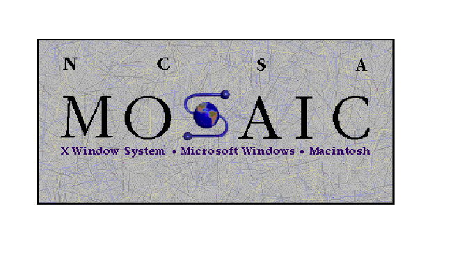
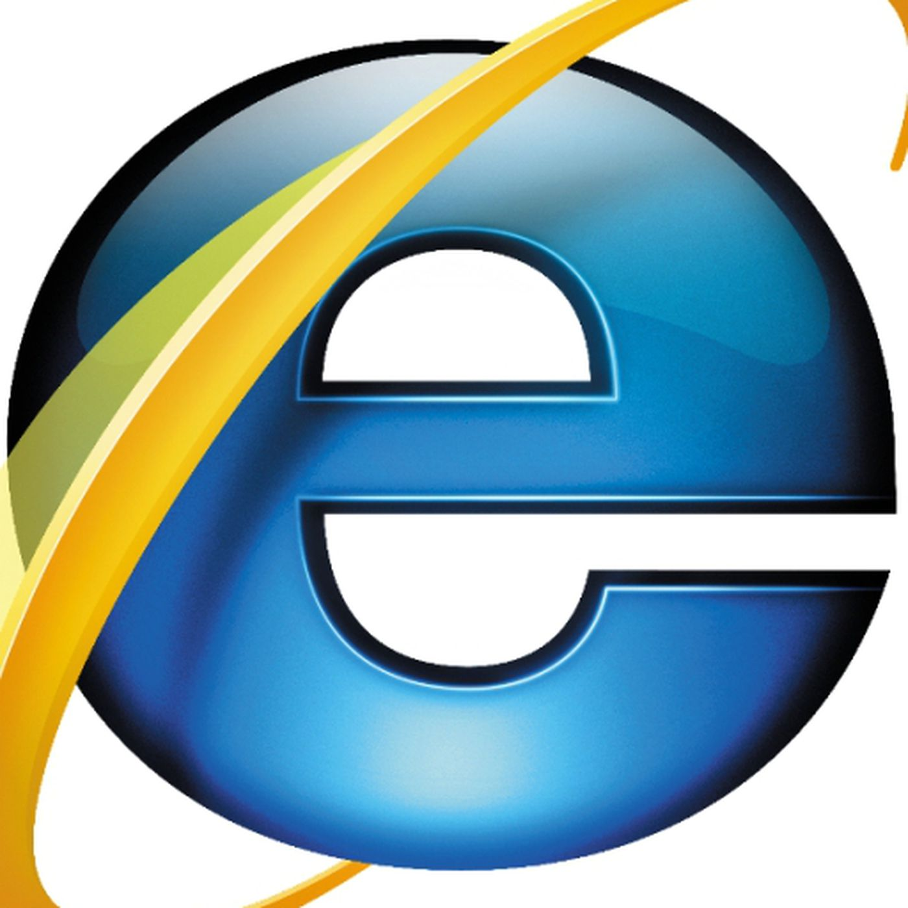

<!DOCTYPE html>
<html lang= "en">
<head>
    <meta charset ="UTF-8">
    <title> HISTORY OF BROWSERS </title>
    <link rel="icon" type="PNG" href="browsers.png" />
    
  </head>
<body>
    <main><h3>THIS IS A SAMPLE PROJECT</h3></main>
    

      <h1>
HISTORY OF BROWSERS
</h1>

    <header> <h2><u>Timeline of browsers </u></h2>
<ul>
<li><strong>1990</strong> &#8211; The WorldWideWeb (not to be confused with the World Wide Web) was the first browser ever created by W3C Director Tim Berners-Lee, then renamed Nexus to differentiate from the actual World Wide Web. Unlike today, this was the only browser and the only way to access the web.</li>
<li><strong>1992</strong> &#8211; Lynx was a texted-based browser that couldn’t display any graphic content.</li>
<li><strong>1993 </strong>&#8211; Mosaic was the first browser to allow images embedded in text making it “the world’s first most popular browser”.</li>
<li><strong>1994</strong> &#8211; A noticeable improvement to Mosaic came Netscape Navigator.</li>
<li><strong>1995</strong> &#8211; Internet Explorer made its debut as Microsoft’s first web browser.</li>
<li><strong>1996</strong> &#8211; Opera started as a research project in 1994 that finally went public two years later. This was also arguably the beginning of the browser wars, mainly between IE 3 and Navigator 3 as Internet Explorer inched ahead with new capabilities.</li>
<li><strong>2003</strong> &#8211; Apple’s Safari browser was released specifically for Macintosh computers instead of Navigator.</li>
<li><strong>2004</strong> &#8211; Mozilla launched Firefox as Netscape Navigator faded out.</li>
<li><strong>2007</strong> &#8211; Mobile Safari was introduced as Apple’s mobile web browser and continues to dominate the iOS market.</li>
<li><strong>2008</strong> &#8211; Google Chrome appeared to soon take over the browser market.</li>
<li><strong>2011</strong> &#8211; Opera Mini was released to focus on the fast-growing mobile browser market.</li>
<li><strong>2015</strong> &#8211; Microsoft Edge was born to combat Google.</li>
</ul>
    </header>
    <section> The Revolutionary Broweser among all was<b><i> MOSAIC</i></b> which allowed to display visual images for the first time  
    <h2><u>MOSAIC </u> </h2>
    
 Mosaic was the first browser to allow images in text making it “the world’s first most popular browser”. 
         
    <h2><u>NETSCAPE</u></h2> 
        
 Netscape was formed by the founders of mosaic so can be said as a improved version of mosaic. 

        
         
        <h2><u>Internet Explorer</u> </h2>
        
 Internet Explorer was formed by Microsoft as a competition to netscape in 1995 this was the bestest browser at that time and come inbuild with windows operating systems  

           

        
    </section>
    <section> After this there were more browsers as listed 

    <ul>
        <li> </li>
        <li>  </li>
        <li>  </li>
         <li>  </li>
         <li>  </li>
      </ul>
      </section>
<footer> if you have intrest see a full documentry on <a href="https://www.youtube.com/watch?v=VANORrzKX50">History of Internet:Browsers</a> 
    
&copy; This page was created by Sampurna nand shukla . To know more about him, visit <a href="https://www.instagram.com/sampurnaa_29/">Developers Instagram.</a>

                                                        
</footer>                           
</body>
</html>       
